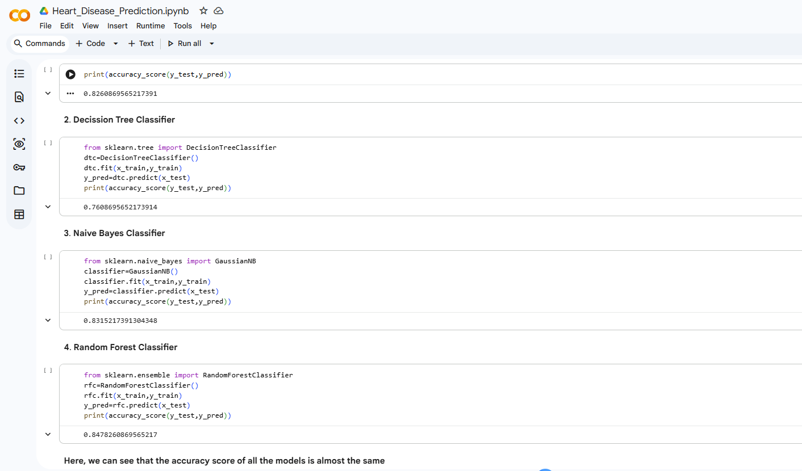
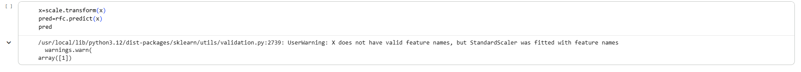

# Heart Disease Prediction

This project predicts the probability of heart disease using machine learning.

Algorithms Used
Logistic Regression
Decision Tree
Random Forest

Libraries
Python
Scikit-learn
Pandas
NumPy

## Project Output

## Project Output

